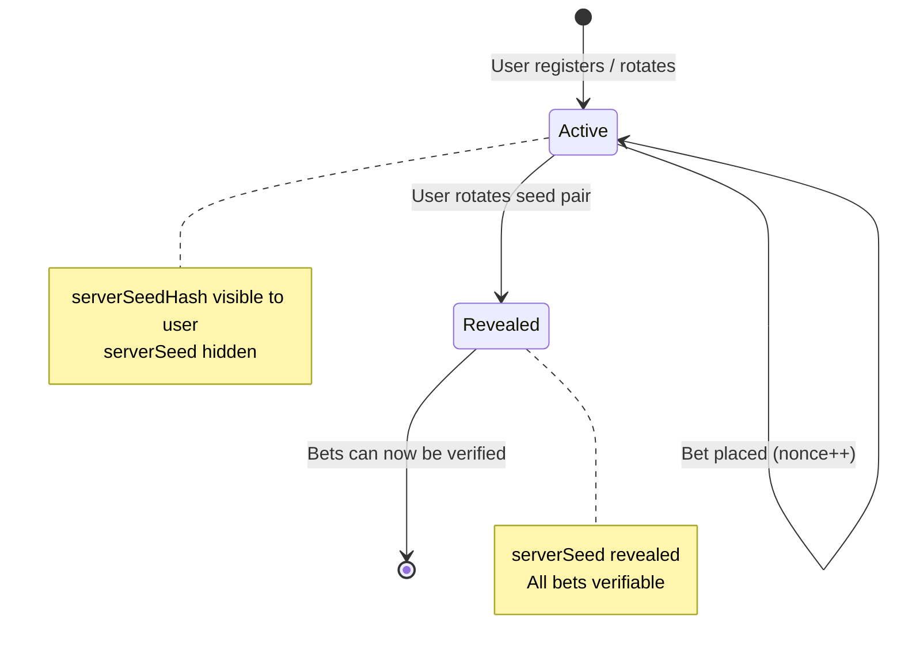
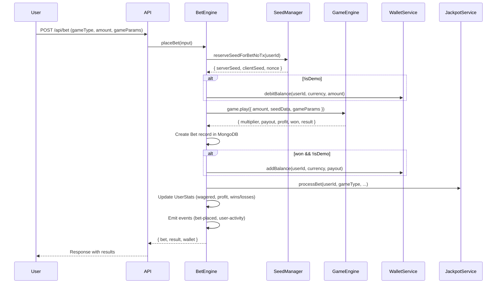

# BetStake — Complete Technical Documentation

> **Confidential — For Senior Developer Review**
> Last Updated: February 18, 2026

---

## Table of Contents

1. [Project Overview](#1-project-overview)
2. [Architecture & Technology Stack](#2-architecture--technology-stack)
3. [Package Structure (Monorepo)](#3-package-structure-monorepo)
4. [Provably Fair System — Deep Dive](#4-provably-fair-system--deep-dive)
5. [Game Engine — All 18 Games](#5-game-engine--all-18-games)
6. [Bet Engine — Core Bet Processing](#6-bet-engine--core-bet-processing)
7. [Wallet Service](#7-wallet-service)
8. [Unified Jackpot System](#8-unified-jackpot-system)
9. [Rakeback System](#9-rakeback-system)
10. [Auto-Bet System](#10-auto-bet-system)
11. [Strategy Engine](#11-strategy-engine)
12. [Real-Time WebSocket Games](#12-real-time-websocket-games)
13. [Admin Panel & Platform Settings](#13-admin-panel--platform-settings)
14. [House Edge & Probability Fairness — Mathematical Proof](#14-house-edge--probability-fairness--mathematical-proof)
15. [Database Schema Overview](#15-database-schema-overview)
16. [API Route Map](#16-api-route-map)
17. [Deployment & Infrastructure](#17-deployment--infrastructure)

---

## 1. Project Overview

BetStake is a full-stack, provably fair online casino platform offering **18 games** across multiple categories:

| Category | Games |
|---|---|
| **Instant** | Dice, Limbo, CoinFlip, Wheel |
| **Crash-Family** | Crash (Multiplayer + Trenball), Solo Crash, Rush |
| **Grid/Reveal** | Mines, Tower, Stairs |
| **Card** | Blackjack, Hi-Lo |
| **Draw** | Keno, Roulette, Fast Parity |
| **Physics** | Plinko (Normal + Super + Lightning), Balloon |
| **PvP** | Ludo (Multiplayer) |

All games (except Ludo) use a **Stake-compatible provably fair RNG** based on HMAC-SHA256, meaning every bet can be independently verified by the player after the server seed is revealed.

---

## 2. Architecture & Technology Stack

```
┌────────────────────────────────────────────────────────┐
│                     FRONTEND (Next.js)                 │
│  React 18 · TypeScript · Socket.IO Client · App Router │
│  Port: 3000                                            │
└──────────────────────┬─────────────────────────────────┘
                       │ HTTP REST + WebSocket
┌──────────────────────▼─────────────────────────────────┐
│                     BACKEND (Express + Socket.IO)       │
│  Node.js · TypeScript · Mongoose · BullMQ (Redis)      │
│  Port: 3001                                            │
├────────────────────────────────────────────────────────┤
│  Services: BetEngine, WalletService, AutoBetService,   │
│            UnifiedJackpotService, RakebackService,      │
│            StrategyEngine, PvPGameService               │
├────────────────────────────────────────────────────────┤
│  WebSocket Namespaces: /crash, /fastparity, /ludo      │
└──────────────────────┬─────────────────────────────────┘
                       │
        ┌──────────────┼──────────────┐
        ▼              ▼              ▼
   ┌─────────┐   ┌─────────┐   ┌──────────┐
   │ MongoDB  │   │  Redis   │   │ BullMQ   │
   │ (Data)   │   │ (Cache)  │   │ (Queues) │
   └─────────┘   └─────────┘   └──────────┘
```

**Shared Packages (Turborepo Monorepo):**

| Package | Purpose |
|---|---|
| `@casino/fairness` | RNG, Seed Manager, Verifier |
| `@casino/game-engine` | All 18 game implementations + registry |
| `@casino/database` | Mongoose schemas (31), indexes, seeders |
| `@casino/shared` | Shared types, constants, utilities |

---

## 3. Package Structure (Monorepo)

```
betstake/
├── apps/
│   ├── frontend/           # Next.js App Router
│   │   └── src/app/game/   # 18 game pages
│   └── backend/
│       └── src/
│           ├── index.ts          # Express + Socket.IO entry
│           ├── routes/           # 27 API route files
│           ├── services/         # 13 service files
│           ├── middleware/       # Auth middleware (JWT)
│           └── websocket/        # crash.ts, fastparity.ts, ludo.ts
├── packages/
│   ├── fairness/           # Provably fair RNG system
│   ├── game-engine/        # Game logic for all 18 games
│   ├── database/           # Mongoose models & schemas
│   └── shared/             # Shared types & utilities
├── turbo.json              # Turborepo pipeline config
└── package.json            # Root workspace
```

---

## 4. Provably Fair System — Deep Dive

### 4.1 Core Algorithm — HMAC-SHA256 (Stake-Compatible)

The fairness system is implemented in `@casino/fairness` and follows the **Stake.com provably fair standard**.

#### Seed Structure

Every user has an **active seed pair**:

| Field | Description |
|---|---|
| `serverSeed` | 64-char hex string — `crypto.randomBytes(32).toString('hex')` |
| `serverSeedHash` | SHA-256 hash of `serverSeed` — shown to user BEFORE any bets |
| `clientSeed` | 32-char hex string — set by user or auto-generated |
| `nonce` | Integer starting at 0 — auto-incremented after each bet |

#### Byte Generation (Cursor System)

The core RNG uses HMAC-SHA256 with an unlimited byte generation system:

```
HMAC Message = "{clientSeed}:{nonce}:{currentRound}"
HMAC Key     = serverSeed
Output       = HMAC-SHA256(key, message)  →  32 bytes per round
```

**Cursor system:**
- `currentRound = floor(cursor / 32)` — determines which HMAC round to use
- `position = cursor % 32` — determines byte offset within the 32-byte output
- Multiple HMAC rounds generated sequentially as more bytes are needed

#### Float Generation

4 bytes (32-bit unsigned integer) are consumed per float:

```
float = UInt32BE(bytes[offset..offset+3]) / 2^32
```

This produces a value in `[0.0, 1.0)` with effectively 32 bits of precision.

#### Cursor Allocation Per Game

Different games require different numbers of random floats, allocated via cursor offsets:

| Game | Cursor Start | Floats Needed | Reason |
|---|---|---|---|
| Dice, Limbo, CoinFlip, Wheel, Roulette, Crash, Rush, SoloCrash, Balloon, FastParity | 0 | 1 | Single outcome |
| Keno | 2 | 40 | Shuffle 40 numbers |
| Plinko | 2 | 8–16 (rows) | One float per peg row |
| Mines | 3 | 25 (grid size) | Shuffle tile positions |
| Tower | 3 | floors × 3 | Shuffle per floor |
| Stairs | 3 | steps × 2 | Shuffle per step |
| HiLo | 13 | 2+ | Card draws |
| Blackjack | 13 | 52 | Full 6-deck shuffle |

### 4.2 Seed Lifecycle



**Key operations:**
1. **`createSeedPair(userId)`** — generates new server seed, hashes it, creates record
2. **`reserveSeedForBetNoTx(userId)`** — atomically reads nonce and increments it
3. **`rotateSeedPair(userId)`** — deactivates current pair (reveals server seed), creates new pair
4. **Integrity check** — on rotation, re-hashes the server seed to verify it matches the stored hash

### 4.3 Bet Verification

After seed rotation reveals the server seed, any bet can be re-computed:

```typescript
const verification = verifyGame({
  serverSeed: "abc123...",      // Now revealed
  clientSeed: "def456...",      // Always visible
  nonce: 42,                    // Bet's nonce
  gameType: "DICE",
  gameParams: { target: 50, isOver: true },
});
// Returns: { result: { roll: 67.32 }, floats: [0.6732...], hmac: "..." }
```

The system then compares the stored result with the recomputed result:
```typescript
matches = JSON.stringify(bet.result) === JSON.stringify(verification.result);
```

### 4.4 Fairness Guarantees

> [!IMPORTANT]
> The house **CANNOT manipulate outcomes**. The server seed is committed (via SHA-256 hash) before ANY bets are placed. Changing the server seed would change the hash, which the player has already recorded. The client seed and nonce are chosen or visible to the player.

1. **Pre-commitment**: Server seed hash is shown before betting begins
2. **Determinism**: Same inputs (serverSeed + clientSeed + nonce) always produce the same output
3. **Independence**: Each bet uses a unique nonce, making outcomes independent
4. **Verifiability**: After rotation, players can verify every past bet
5. **Client influence**: Players can change their client seed at any time, influencing outcomes

---

## 5. Game Engine — All 18 Games

All games extend `BaseGame` and implement the `play(input: BetInput): BetResult` interface.

### 5.1 Dice

**Type:** Instant | **RNG:** 1 float | **House edge:** Applied to multiplier

**Modes:**
- **Classic** — User sets target (0–100), bets over/under
- **Ultimate** — User defines a range [start, end], bets inside/outside the range

**Outcome formula:**
```
roll = floor(float × 10001) / 100     // Range: 0.00 – 100.00
```

**Win chance:**
- Classic over: `(100 - target)%`
- Classic under: `target%`
- Ultimate inside: `(rangeEnd - rangeStart)%`

**Payout multiplier:**
```
baseMultiplier = 99 / winChance
finalMultiplier = baseMultiplier × (1 - houseEdge/100)
```

**Example:** Target 50, Over → Win chance = 50% → Base = 1.98× → Final (1% edge) = 1.9602×

---

### 5.2 Limbo

**Type:** Instant | **RNG:** 1 float | **House edge:** Applied to result and payout

**Outcome formula (Stake's formula):**
```
floatPoint = (1 / float) × (1 - houseEdge/100)
crashPoint = max(floor(floatPoint × 100) / 100, 1.00)
```

**Win condition:** `crashPoint >= targetMultiplier`

**Probability distribution:** Follows inverse distribution — higher targets are exponentially less likely:

| Target | Approximate Win Chance |
|---|---|
| 1.00× | ~99% |
| 2.00× | ~49.5% |
| 10.00× | ~9.9% |
| 100.00× | ~0.99% |

---

### 5.3 Crash (Multiplayer)

**Type:** Real-time multiplayer | **RNG:** 1 float per round | **WebSocket:** `/crash` namespace

**Crash point formula:**
```
crashPoint = min((99 × (1 - houseEdge/100)) / (100 × float), 10000)
```

**Game flow (server-driven):**
1. **Betting phase** (10s countdown) — players place bets via WebSocket
2. **Running phase** — multiplier grows exponentially: `e^(0.00006 × elapsedMs)`
3. **Crash** — when multiplier reaches crash point, round ends
4. **Cashout** — players can cash out anytime before crash

**Trenball mode** (derived from crash point):
| Condition | Result | Payout |
|---|---|---|
| Crash < 2× | crash | 49.99× |
| Crash ≥ 10× | moon | 10× |
| Even decimal | green | 2× |
| Odd decimal | red | 1.96× |

---

### 5.4 Solo Crash

**Type:** Instant | **RNG:** 1 float | **Same formula as Crash**

**Modes:**
- **Quick Rise** — auto-cashout at 2.0×, instant result
- **Custom Rise** — user sets target multiplier, instant result

---

### 5.5 Rush

**Type:** Instant | **RNG:** 1 float | **Difficulty-constrained crash**

**Difficulty ranges:**

| Difficulty | Min Target | Max Target |
|---|---|---|
| Easy | 1.5× | 5× |
| Medium | 1.2× | 10× |
| Hard | 1.1× | 50× |
| Expert | 1.01× | 100× |

**Crash point formula:**
```
h = floor((1 - float) × 2^32)
crashPoint = clamp(0.99 × 2^32 / h, range.min, range.max)
```

---

### 5.6 Mines

**Type:** Session-based | **RNG:** Fisher-Yates shuffle (cursor=3) | **Grid: 4×4, 5×5, or 6×6**

**Grid generation:**
1. Create array: `[true, true, ..., false, false, ...]` (mines count × true, rest false)
2. Shuffle using Fisher-Yates with provably fair floats
3. Mine positions are deterministic from seed data

**Multiplier calculation (progressive):**
```
multiplier = 1
for each safe tile revealed:
    remainingSafe = safeTiles - i
    remainingTotal = gridSize - i
    multiplier *= (1 / (remainingSafe / remainingTotal))
finalMultiplier = multiplier × (1 - houseEdge/100)
```

**Example (5×5 grid, 5 mines):**
| Tiles Revealed | Win Probability | Multiplier (1% edge) |
|---|---|---|
| 1 | 80.0% | 1.2375× |
| 3 | 43.5% | 2.2726× |
| 5 | 18.5% | 5.3460× |
| 10 | 0.75% | 131.41× |

---

### 5.7 Tower

**Type:** Session-based | **RNG:** Fisher-Yates shuffle per floor (cursor=3) | **Floors: 8, 10, 12, 15**

**Grid structure:** 3 tiles per floor, 2 are danger (bomb), 1 is safe.

**Multiplier:** `1.5^(safeFloorsCleared) × (1 - houseEdge/100)`

| Floors Cleared | Multiplier (1% edge) |
|---|---|
| 1 | 1.485× |
| 4 | 5.006× |
| 8 | 25.28× |
| 15 | 569.78× |

---

### 5.8 Stairs

**Type:** Session-based | **RNG:** Fisher-Yates shuffle per step (cursor=3) | **Steps: 8, 10, 12, 15**

**Grid structure:** 2 tiles per step, 1 is danger, 1 is safe. (50% chance per step)

**Multiplier:** `1.4^(safeStepsCleared) × (1 - houseEdge/100)`

---

### 5.9 Plinko

**Type:** Instant | **RNG:** N floats (one per row) | **Rows: 8–16 | Risk: Low/Medium/High**

**Path generation:**
```
for each row: direction = float < 0.5 ? LEFT : RIGHT
finalSlot = sum of all RIGHT decisions
```

Each slot maps to a predefined multiplier from lookup tables.

**Additional modes:**
- **Super Mode** — multiplier table is shuffled using a payout seed (SHA-256 based Fisher-Yates)
- **Lightning Mode** — golden pegs with bonus multipliers + dead zones (instant loss slots)

**High-risk 16-row multiplier table:**
```
[1000, 130, 26, 9, 4, 2, 0.2, 0.2, 0.2, 0.2, 0.2, 2, 4, 9, 26, 130, 1000]×
```

---

### 5.10 Keno

**Type:** Instant | **RNG:** Fisher-Yates shuffle of 1–40 (cursor=2) | **Risk: Low/Medium/High**

**Gameplay:** Player selects 1–10 numbers from 1–40. System draws 10 random numbers.

**Payout tables** (predefined per risk × selection count):

| Risk | Select 10, Match 10 |
|---|---|
| Low | 1000× |
| Medium | 2500× |
| High | 5000× |

---

### 5.11 Roulette

**Type:** Instant | **RNG:** 1 integer [0–36] | **European layout (single zero)**

**Bet types and payouts:**

| Bet Type | Payout | Probability |
|---|---|---|
| Straight (single #) | 36× | 2.70% |
| Split (2 numbers) | 18× | 5.41% |
| Street (3 numbers) | 12× | 8.11% |
| Dozen/Column | 3× | 32.43% |
| Red/Black/Even/Odd | 2× | 48.65% |

> [!NOTE]
> House edge is inherent via the green zero pocket. A bet on red has 18/37 = 48.65% chance, but pays 2× (true fair payout would be 2.0556×).

---

### 5.12 Wheel

**Type:** Instant | **RNG:** 1 integer [0, segments-1] | **Segments: 10, 20, 30, 40, 50**

**Multiplier tables** are predefined for each risk × segment count combination.

**Example — High Risk, 10 segments:**
```
[10×, 2×, 1.5×, 1.2×, 1.2×, 1.2×, 1.2×, 1.5×, 2×, 10×]
```

---

### 5.13 CoinFlip

**Type:** Instant | **RNG:** 1 float | **Modes: Normal, Series**

**Normal mode:**
```
result = float < 0.5 ? 'heads' : 'tails'
multiplier = 2 × (1 - houseEdge/100)     // 1.98× at 1% edge
```

**Series mode** — Best of N (3, 5, 7, or 9 flips):
- Win if majority of flips match your choice
- Multiplier = `seriesCount × (1 - houseEdge/100)`

---

### 5.14 Balloon

**Type:** Instant | **RNG:** 1 float

**Difficulty settings:**

| Difficulty | Max Pumps | Base Multiplier/Pump |
|---|---|---|
| Simple | 10 | 0.10 |
| Easy | 20 | 0.08 |
| Medium | 50 | 0.05 |
| Hard | 100 | 0.03 |
| Expert | 200 | 0.02 |

**Burst point:** `floor(float × maxPumps) + 1`

**Pump modes:**
- **Random** — system auto-pumps to a random point below burst
- **Specific** — user specifies exact pump count
- **Custom** — user targets a multiplier, system converts to pumps

---

### 5.15 Fast Parity

**Type:** Real-time (30s rounds) | **RNG:** 1 integer [0–9] | **WebSocket based**

**Number-to-color mapping:**
| Number | Color |
|---|---|
| 0, 5 | Violet |
| 1, 3, 7, 9 | Green |
| 2, 4, 6, 8 | Red |

**Payouts:**

| Bet Type | Payout | Probability |
|---|---|---|
| Exact number | 9× | 10% |
| Violet color | 4.5× | 20% |
| Green/Red color | 1.96× | 40% |
| Even/Odd | 2× | 50% |

---

### 5.16 HiLo

**Type:** Session-based (progressive) | **RNG:** integers [1–13] (cursor=13)

**Gameplay:** A card is shown (1=Ace to 13=King). Player predicts if the next card will be higher, lower, or skips.

**Multiplier per step:**
```
higher: 13 / (14 - currentCard)
lower:  13 / currentCard
skip:   1 (no multiplier change)
```

**Compound multiplier** — Each step multiplies together:
```
totalMultiplier = step1Mult × step2Mult × ... × stepNMult × (1 - houseEdge/100)^N
```

---

### 5.17 Blackjack

**Type:** Session-based | **RNG:** Fisher-Yates shuffle of 6-deck shoe (312 cards, cursor=13)

**Standard rules:**
- Player and dealer each get 2 cards
- Blackjack (21 with 2 cards) pays 2.5× (3:2)
- Normal win pays 2×
- Push (tie) returns bet (1×)
- All payouts reduced by house edge multiplier

**Deck:** 6 standard 52-card decks (312 cards), shuffled using provably fair Fisher-Yates.

---

### 5.18 Ludo (PvP)

**Type:** Real-time multiplayer PvP | **WebSocket:** `/ludo` namespace

**Gameplay:**
- 2–4 players, each stakes an entry fee
- Winner takes the prize pool minus house commission
- Real-time board game with dice rolls, captures, and safe zones
- Matchmaking system pairs players of similar bet sizes

---

## 6. Bet Engine — Core Bet Processing

The `BetEngine` class in `services/bet-engine.ts` is the **central brain** for processing all instant/session bets.

### Bet Flow



### Key Properties

- **No MongoDB transactions** for standard bets (performance optimization)
- **Decimal.js** used in wallet for precision
- **Demo mode** supported — no wallet operations, bet still recorded
- **AutoBet flag** tracked per bet for analytics
- **Strategy ID** linked to bet if using predefined strategy

---

## 7. Wallet Service

Multi-currency wallet system using `Decimal.js` for precision arithmetic.

### Supported Currencies
`BTC`, `ETH`, `USDT`, `USD` (with extensible per-currency bet limits)

### Balance Management

| Operation | Description |
|---|---|
| `debitBalance` | Simple balance deduction |
| `addBalance` | Add winnings |
| `lockBalance` | Move from available to locked (pending bets) |
| `unlockBalance` | Release locked funds |
| `debitAndLockBalance` | Atomic debit + lock within MongoDB session |
| `creditAndUnlockBalance` | Atomic credit + unlock within session |

### Transaction Logging
Every balance change creates a `Transaction` record with:
- `type`: `bet-reserve`, `payout`, `bet-loss`, `deposit`, `withdrawal`
- `beforeAmount` / `afterAmount`: Full audit trail

---

## 8. Unified Jackpot System

The `UnifiedJackpotService` replaces 3 legacy services with a single **admin-configurable** jackpot engine.

### How It Works

1. **Pool accumulation** — A configurable percentage of house edge from every bet feeds the jackpot pool
2. **Condition evaluation** — After each bet, all active jackpot conditions are checked
3. **Player progress tracking** — Win/loss streaks, color streaks, etc. are tracked per-player per-game
4. **Tiered payouts** — Different bet sizes can receive different percentages of the pool

### Jackpot Condition Types

| Type | Description | Example |
|---|---|---|
| `WIN_STREAK` | Win N times in a row | Win 10 consecutive Dice bets |
| `LOSS_STREAK` | Lose N times in a row | Lose 15 consecutive Limbo bets |
| `COLOR_STREAK` | Same color N times (FastParity/Roulette) | 7 reds in a row |
| `HIT_VALUE` | Hit a specific game result | Roll exactly 77.77 in Dice |
| `WIN_NEXT` | Triggered condition — must win next bet | Hit violet in FastParity, then win next |
| `LOSE_NEXT` | Triggered condition — must lose next bet | — |

### Pool Configuration
- **`houseEdgeContribution`** — % of house edge that goes to jackpot pool (admin-set)
- **Tiered payouts** — e.g., bets ≥ $100 get 50% of pool, bets ≥ $10 get 10%
- **Per-game pools** — Each game + currency combo has its own jackpot pool

---

## 9. Rakeback System

Returns a percentage of the house edge back to players based on tiered wagering volume.

### Tier System (Admin-Configurable)

| Tier | Min Wagered | Rakeback % |
|---|---|---|
| Bronze | $0 | 5% |
| Silver | $1,000 | 7% |
| Gold | $10,000 | 10% |
| Platinum | $100,000 | 15% |

*(Example tiers — actual values are admin-configurable)*

### Calculation
```
effectiveHouseEdge = totalHouseEdge × (contributionPercent / 100)
rakebackAmount = effectiveHouseEdge × (tierPercent / 100)
```

### Claim Flow
1. Daily cron job at midnight calculates unclaimed rakeback for all opted-in users
2. User calls `POST /api/rakeback/claim` → atomic MongoDB transaction credits wallet
3. Min/max claim amounts enforced from admin config

---

## 10. Auto-Bet System

Powered by **BullMQ** (Redis-backed job queue) for reliable background execution.

### Architecture

```
┌──────────┐     ┌───────────┐     ┌─────────────┐
│ Frontend  │────▶│ REST API  │────▶│ BullMQ Queue │
│ Start     │     │ /autobet  │     │ "autobet"    │
└──────────┘     └───────────┘     └──────┬──────┘
                                          │
                                   ┌──────▼──────┐
                                   │ Worker       │
                                   │ (Background) │
                                   │ Loops bets   │
                                   └──────┬──────┘
                                          │
                                   ┌──────▼──────┐
                                   │ BetEngine   │
                                   │ placeBet()  │
                                   └─────────────┘
```

### Configuration

```typescript
interface AutoBetConfig {
  numberOfBets: number;        // Max bets to run
  baseAmount: number;          // Starting bet amount
  stopOnProfit?: number;       // Stop if profit exceeds
  stopOnLoss?: number;         // Stop if loss exceeds
  onWin: { reset: boolean; increaseBy?: number };   // % increase on win
  onLoss: { reset: boolean; increaseBy?: number };   // % increase on loss
}
```

### Stop Conditions
- Max bets reached
- Profit target hit
- Loss limit hit
- User manually stops (Redis signal)
- Insufficient balance

### Frontend Sync
- `autobet:stopped` WebSocket event emitted when session ends
- `onStopped` callback in `useAutoBetSocket` hook updates UI state

---

## 11. Strategy Engine

Predefined betting strategies that auto-configure the auto-bet system:

| Strategy | On Win | On Loss |
|---|---|---|
| **Martingale** | Reset to base | Double bet (+100%) |
| **Reverse Martingale** | Double bet (+100%) | Reset to base |
| **Paroli** | Double bet (+100%) | Reset to base |
| **D'Alembert** | Decrease by 10% | Increase by 10% |

Strategies are applied as config overlays on the `AutoBetConfig`.

---

## 12. Real-Time WebSocket Games

Three games use Socket.IO WebSocket connections for real-time multiplayer:

### 12.1 Crash (`/crash` namespace)

**Server-driven round lifecycle:**
1. `crash:countdown` → 10-second betting window
2. `crash:start` → Multiplier starts growing
3. `crash:tick` → Multiplier updates broadcast every ~100ms
4. `crash:crash` → Round ends, results settled
5. `crash:round-history` → Last N rounds broadcast

**Events:**
- Client → Server: `crash:place-bet`, `crash:cashout`
- Server → Client: `crash:countdown`, `crash:start`, `crash:tick`, `crash:crash`, `crash:bet-placed`, `crash:cashout-success`

### 12.2 Fast Parity (`/fastparity` namespace)

**30-second round cycle:**
1. Betting window opens (25s)
2. Result generated
3. Winnings calculated and distributed
4. Next round starts

### 12.3 Ludo (`/ludo` namespace)

**Full PvP board game:**
- Matchmaking → Game session → Turn-based play → Winner determination
- Real-time dice rolls, piece movements, captures
- Surrender, chat, and turn timer features

---

## 13. Admin Panel & Platform Settings

### Configurable Settings

| Setting | Description |
|---|---|
| `defaultHouseEdge` | Global house edge % (applied to all games) |
| `minBetAmount` | Per-currency minimum bet |
| `maxBetAmount` | Per-currency maximum bet |
| Jackpot conditions | Per-game condition types, thresholds, tiers |
| Rakeback tiers | Tier names, percentages, min wagered |
| Challenges | Admin-created challenges with reward pools |

### Admin API Routes
- `POST /api/admin/settings` — Update platform settings
- `POST /api/admin/jackpot-conditions` — CRUD jackpot conditions
- `POST /api/admin/rakeback` — Configure rakeback tiers
- `POST /api/admin/challenges` — Manage challenges
- `GET /api/admin/reports` — Financial reports
- `GET /api/admin/logs` — Activity logs

---

## 14. House Edge & Probability Fairness — Mathematical Proof

### 14.1 Where House Edge Is Applied

> [!IMPORTANT]
> **The house edge is NEVER applied to the RNG output.** It is applied exclusively to the payout multiplier. The random number generation is pure and unbiased.

**Formula used across all games:**
```
finalMultiplier = baseMultiplier × (1 - houseEdge / 100)
```

At the default 1% house edge:
```
finalMultiplier = baseMultiplier × 0.99
```

### 14.2 Mathematical Proof of Fairness

#### Dice Example

| Parameter | Value |
|---|---|
| Target | 50.00 (bet over) |
| Win chance | 50% |
| Fair multiplier | 99 / 50 = 1.98× |
| With 1% edge | 1.98 × 0.99 = 1.9602× |

**Expected Value (EV) per $1 bet:**
```
EV = 0.50 × $1.9602 + 0.50 × $0 = $0.9801
House Edge = 1 - 0.9801 = 1.99% effective
```

> [!NOTE]
> The formula `99 / winChance` (instead of `100 / winChance`) already embeds ~1% edge. The additional `(1 - houseEdge/100)` multiplier adds the admin-configurable portion.

#### Limbo Example

| Parameter | Value |
|---|---|
| Target | 2.00× |
| Win chance | ~49.5% (derived from `1/float × 0.99 >= 2.00`) |
| Payout | 2.00 × 0.99 = 1.98× |

**Expected Value:**
```
EV = 0.495 × $1.98 = $0.9801 per $1 bet
Effective house edge ≈ 1.99%
```

#### Crash Point Distribution

The crash point follows an inverse distribution:
```
P(crashPoint >= x) ≈ 0.99 / x    (for x >= 1.01)
```

This means:
- ~99% of rounds survive past 1.01×
- ~49.5% survive past 2×
- ~9.9% survive past 10×
- ~0.99% survive past 100×

#### Mines Probability

For a 5×5 grid with 5 mines, the probability of surviving N tiles:

```
P(survive N tiles) = ∏(i=0 to N-1) [(20-i) / (25-i)]
```

| N Tiles | Probability | Multiplier (with edge) |
|---|---|---|
| 1 | 80.00% | 1.24× |
| 5 | 18.47% | 5.35× |
| 10 | 0.75% | 131× |
| 20 | 0.0000045% | ~22,000,000× |

### 14.3 RTP (Return to Player)

| Game | Theoretical RTP |
|---|---|
| Dice (1% edge, 99-base) | ~98.01% |
| Limbo | ~98.01% |
| Crash | ~98.01% |
| CoinFlip | ~99% (2× × 0.99 = 1.98) |
| Roulette | ~97.3% (inherent from 0 pocket) |
| Plinko | Varies by risk (93–99%) |
| Keno | Varies by risk (93–99%) |
| Blackjack | ~98.51% (BJ 2.5× × 0.99) |

### 14.4 Independence Guarantee

Each bet uses a unique `(serverSeed, clientSeed, nonce)` tuple. Since HMAC-SHA256 is a cryptographic PRF:
- Knowing the output of one bet reveals **zero information** about any other bet
- The nonce increments monotonically, ensuring no two bets share the same input
- Past results cannot predict future results

---

## 15. Database Schema Overview

The `@casino/database` package contains 31 Mongoose schemas:

| Schema | Purpose |
|---|---|
| `User` | User accounts (username, email, password hash, roles) |
| `Wallet` | Per-user per-currency balance + locked balance |
| `Transaction` | Full transaction audit log |
| `Bet` | Every bet placed (game type, amount, result, seed ref) |
| `SeedPair` | Server/client seed pairs per user |
| `UserStats` | Aggregated wagering stats per user |
| `UserSettings` | User preferences (rakeback opt-in, etc.) |
| `Jackpot` | Jackpot pool per game per currency |
| `JackpotWin` | Jackpot win records |
| `JackpotConditionConfig` | Admin-configured jackpot conditions |
| `JackpotPlayerProgress` | Per-player jackpot progress tracking |
| `Rakeback` | Unclaimed/claimed rakeback records |
| `RakebackConfig` | Admin-configured rakeback tiers |
| `PlatformSettings` | Global platform configuration |
| `CrashRound` | Crash game round history |
| `FastParityRound` | Fast Parity round history |
| `LudoGame` | Ludo game session records |
| `Challenge` | Admin-created challenges |
| `ActivityLog` | User activity audit trail |

---

## 16. API Route Map

### Authentication
| Method | Route | Description |
|---|---|---|
| POST | `/api/auth/register` | Register new user |
| POST | `/api/auth/login` | Login (JWT) |

### Betting
| Method | Route | Description |
|---|---|---|
| POST | `/api/bet/place` | Place a bet (all instant games) |
| GET | `/api/bet/history` | User's bet history |
| GET | `/api/bet/verify/:id` | Verify a past bet |

### Session Games (REST-based rounds)
| Method | Route | Description |
|---|---|---|
| POST | `/api/mines/start` | Start mines session |
| POST | `/api/mines/reveal` | Reveal a tile |
| POST | `/api/mines/cashout` | Cash out current winnings |
| POST | `/api/tower/start` | Start tower session |
| POST | `/api/stairs/start` | Start stairs session |
| POST | `/api/hilo/start` | Start HiLo session |
| POST | `/api/blackjack/deal` | Deal blackjack hand |
| POST | `/api/blackjack/action` | Hit/Stand/Double/Split |

### Wallet
| Method | Route | Description |
|---|---|---|
| GET | `/api/wallet` | Get user wallets |

### Seeds
| Method | Route | Description |
|---|---|---|
| GET | `/api/seed/active` | Get active seed pair (hash only) |
| POST | `/api/seed/rotate` | Rotate seed pair (reveals old) |
| POST | `/api/seed/client` | Update client seed |

### Jackpot & Rakeback
| Method | Route | Description |
|---|---|---|
| GET | `/api/jackpot` | Get all jackpot pools |
| GET | `/api/rakeback/unclaimed` | Get unclaimed rakeback |
| POST | `/api/rakeback/claim` | Claim rakeback |

---

## 17. Deployment & Infrastructure

### Production Stack
- **VPS:** Ubuntu server at `72.60.205.209`
- **Domain:** `stack.bxpro99.xyz`
- **Process Manager:** PM2
- **Reverse Proxy:** Nginx (SSL via Let's Encrypt)
- **Database:** MongoDB (same server or Atlas)
- **Cache/Queue:** Redis + BullMQ

### Environment Variables
```env
DATABASE_URL=mongodb://localhost:27017/betstake
REDIS_HOST=localhost
REDIS_PORT=6379
JWT_SECRET=<secret>
FRONTEND_URL=https://stack.bxpro99.xyz
PORT=3001
```

---

> **Document generated from source code analysis on February 18, 2026**
> For questions, contact the development team.
